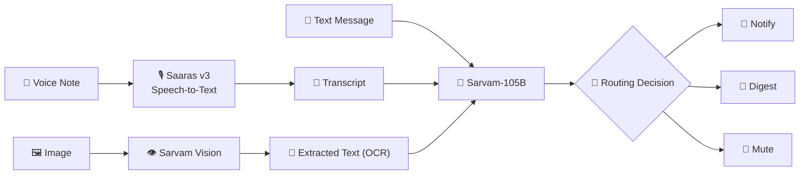

# Message Notification Router

A personalized WhatsApp notification router, run entirely from the terminal. For every message in `dataset/messages.csv` it decides `notify` / `digest` / `mute` using Sarvam AI for multimodal reasoning.

All routing decisions come from **Sarvam-105B**.



## Layout

```
Code/
├── main.py                 # CLI entry point, it writes dataset/output.csv
├── evalution/main.py       # scores output.csv against a labeled ground-truth file
├── src/
│   ├── config.py           # paths, model names, fail-fast API key validation
│   ├── data_loader.py      # loads every dataset CSV into a Dataset object
│   ├── media_processor.py  # Saaras v3 (audio) + Sarvam Vision (image), with retries
│   ├── context_builder.py  # joins user/group/business/history signals per message
│   └── llm_router.py       # prompts Sarvam-105B, validates JSON, retries on failure
├── requirements.txt
```

## Setup

```bash
pip install -r requirements.txt
touch .env
SARVAM_API_KEY=...    # then fill api key in SARVAM_API_KEY
```

## Run

```bash
python main.py
```

Writes `dataset/output.csv` with columns:
`message_id, action, message_type, reason, confidence, evidence_message_ids`.

Useful flags:

```bash
python main.py --limit 5              # process only the first 5 messages (debugging)
python main.py --workers 8            # more concurrent Sarvam API calls (default 4)
python main.py --verbose              # debug-level logging
python main.py --allow-partial        # write output.csv with successful rows even if some fail
```

## How a decision is made

1. **`data_loader.py`** loads every CSV (`users`, `groups`, `group_members`, `business_accounts`, `user_business_history`, `message_history`, `message_events`, `images`, `voice_notes`, `daily_notification_summary`).
2. **`media_processor.py`** resolves any `media_type` / `media_id` on the message: voice notes go through Saaras v3 (`speech_to_text.transcribe`, `model="saaras:v3"`), images/posters go through Sarvam Vision (`document_intelligence` job -> OCR/markdown). If a file can't be read, or the Sarvam call fails after retries, the pipeline records `media_status="unavailable"` instead of guessing at content.
3. **`context_builder.py`** assembles one JSON context per message: user engagement/report/DND stats, group role of the *sender* (admin vs member) and whether the *receiving user* has muted the group or is @-mentioned, business verification + the user's real relationship to that business (order/booking/payment history, promo opt-in/out), repetition signals (past messages from the same sender/business, and whether similar messages were previously reported/dismissed), explicit lexical signals (scam/forward-chain/promo keyword hits - handed to the
   model as *observations*, not as a decision rule), and recent daily notification load.
4. **`llm_router.py`** sends that context, plus a few-shot block built from `sample_messages.csv`, to Sarvam-105B with a system prompt encoding the product policy (risk overrides engagement, muted groups can still surface direct mentions, unopted promotions don't `notify`, etc.) and asks for strict JSON. The response is validated against the allowed `action` / `message_type` enums before being trusted.